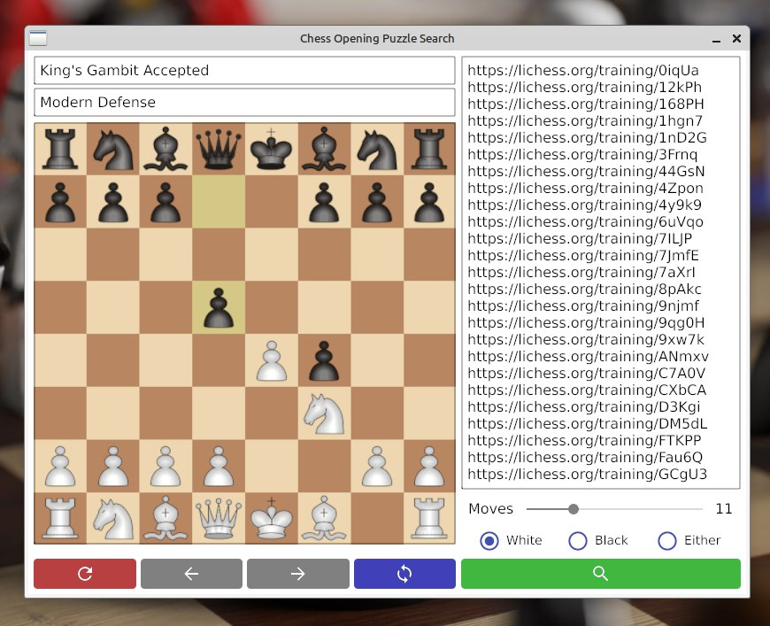

# Chess Opening Puzzle Search

COPS is an application that provides a better alternative to the opening puzzle search on Lichess. 
It enables users to not only search for puzzles by the official opening name but also to specify 
a custom set of moves following the opening and define the number of moves that can be played after 
a given position. This flexibility allows for a more tailored exploration of chess openings and puzzles.

## Overview

COPS is designed for chess enthusiasts who wish to dive deeper into opening theory. 
Whether you want to quickly find puzzles related to a standard opening or explore unique move sequences 
after the opening, COPS offers an interactive and efficient solution. Built with Go, the application combines 
performance with a user-friendly GUI.

**Note:** 
This project is still under active development. Some features might be incomplete or subject to change, 
and we are not currently accepting pull requests.

## Features

- **Intuitive GUI Interface:** Enjoy a modern windowed application designed for ease of use.
- **Advanced Search Capabilities:**
    - **Official Opening Name:** Search for puzzles by the established opening name.
    - **Custom Move Sequences:** Specify a set of moves to further refine your search.
    - **Move Depth Control:** Define the number of moves that can be played after a given position.
- **Comprehensive Puzzle Database:** Access a wide range of puzzles that cover various openings and move sequences.
- **Optimized Performance:** Developed in Go to ensure quick response times and smooth user interactions.

## Usage example



## Installation

Before you begin, ensure you have [Go](https://golang.org) installed (version 1.16 or higher is recommended).

Clone the repository:

```bash
git clone https://github.com/failosof/cops.git
cd cops
```

Build the application:

```bash
go build -o cops
```

Run the application:

```bash
./cops
```

## Current Status

This application is currently in active development. As a work in progress, some features may not be fully implemented, 
and the user interface may undergo changes. 
**Please note:** 
At this stage, we are not accepting pull requests or external contributions.

## Contributing

We appreciate your interest in contributing! However, this repository is closed to external pull requests for now. 
We encourage you to follow the project for updates and future opportunities to contribute.

## License

This project is licensed under the MIT License. See the [LICENSE](LICENSE) file for details.

## Acknowledgments

- **Lichess:** For inspiring the concept and providing a benchmark for chess puzzle search.
- **The Go Community:** For the robust (and not) libraries and tools that support the development of this application.
